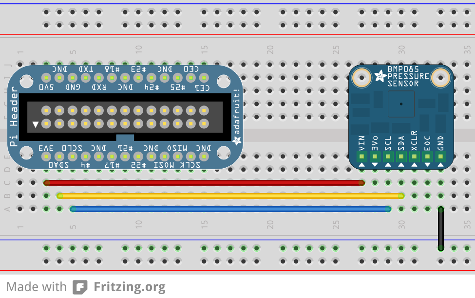

## I2C - Temperature and Pressure Sensor

_This example will use the Raspberry Pi's I2C interface to read the current temperature and barometric pressure from the BMP180 sensor_

### What is I2C?

I2C (eye-squared-cee) is a communication protocol that the Raspberry Pi can use to speak to other embedded devices (temperature sensors, displays, accelerometers, etc). In this example, we'll be connecting a BMP180 Temperature/Pressure Sensor to our Raspberry Pi. 

I2C is a two wire bus, the connections are called SDA (Serial Data) and SCL (Serial Clock). Each I2C bus has one or more masters (the Raspberry Pi) and one or more slave devices, like the I/O Expander. As the same data and clock lines are shared between multiple slaves, we need some way to choose which device to communicate with. With I2C, every device has an address that each communication must be prefaced with. The temperature sensor defaults to an address of 0x77. Remember this number as we'll see it shortly when we try to detect the chip using `i2cdetect`.

The Rasperry Pi has two I2C buses. One is available on the GPIO (P1) header, the other is only available from the P5 header. To access the P5 header, you'll need to solder on your own header pins. This is generally unnecessary as you typically only need a single I2C bus. 

### Connecting the BMP180

### Preparing RPi for I2C
Comment out the i2c-bcm2708 line from the raspi-blacklist.conf file:

pi@raspberrypi:~$ sudo nano /etc/modprobe.d/raspi-blacklist.conf 

#blacklist i2c-bcm2708 


Add i2c-dev to /etc/modules

pi@raspberrypi:~$ sudo nano /etc/modules
i2c-dev


Then from the prompt run:

sudo modprobe i2c_bcm2708
sudo modprobe i2c-dev 


Confirm that the i2c modules are loaded and active:

pi@raspberrypi ~ $ lsmod  | grep i2c
i2c_dev                 6276  0
i2c_bcm2708             4121  0


Install some i2c utilities:

pi@raspberrypi:~$ sudo apt-get update
pi@raspberrypi:~$ sudo apt-get install i2c-tools


i2c-tools includes some cool utilities, like `i2cdetect`, which will enumerate the addresses of all slave devices on a single bus. Try it out by running `sudo i2cdetect -y 1` with the sensor connected. Another utility, `i2cdump` lets you query the state of individual settings (registers) on a specific I2C device. This is the output you should see with the sensor connected as below, and configured for the default address of 0x77:

pi@pi-friedrich ~ $ sudo i2cdetect -y 1
     0  1  2  3  4  5  6  7  8  9  a  b  c  d  e  f
00:          -- -- -- -- -- -- -- -- -- -- -- -- --
10: -- -- -- -- -- -- -- -- -- -- -- -- -- -- -- --
20: -- -- -- -- -- -- -- -- -- -- -- -- -- -- -- --
30: -- -- -- -- -- -- -- -- -- -- -- -- -- -- -- --
40: -- -- -- -- -- -- -- -- -- -- -- -- -- -- -- --
50: -- -- -- -- -- -- -- -- -- -- -- -- -- -- -- --
60: -- -- -- -- -- -- -- -- -- -- -- -- -- -- -- --
70: -- -- -- -- -- -- -- 77


### Reading values from the BMP180
First we'll need to install some utilities for the Raspberry Pi to communicate over I2C inside of Python.

pi@raspberrypi:~$ sudo apt-get install build-essential python-dev python-smbus
pi@raspberrypi:~$ git clone https://github.com/adafruit/Adafruit_Python_BMP.git
pi@raspberrypi:~$ cd Adafruit_Python_BMP
pi@raspberrypi:~$ sudo python setup.py install


Next, place the following into a Python script and run it. 

import Adafruit_BMP.BMP085 as BMP085

sensor = BMP085.BMP085()
temp = sensor.read_temperature()
pressure = sensor.read_pressure()

print 'Temp = {0:0.2f} *C'.format(temp)
print 'Pressure = {0:0.2f} Pa'.format(pressure)


#### FAQ
* Q. When I run the script, I get the following error: `Traceback (most recent call last):
  File "<stdin>", line 1, in <module>
  File "/usr/local/lib/python2.7/dist-packages/Adafruit_BMP-1.0.0-py2.7.egg/Adafruit_BMP/BMP085.py", line 66, in __init__
    self._device = I2C.Device(address, busnum)
  File "/usr/local/lib/python2.7/dist-packages/Adafruit_GPIO-0.5.5-py2.7.egg/Adafruit_GPIO/I2C.py", line 68, in __init__
    self._bus = smbus.SMBus(busnum)
IOError: [Errno 2] No such file or directory
`
* A: Ensure you have loaded the i2c_bcm2708 and i2c-dev modules using `lsmod`. If they are not present, follow the instructions at the top of the page to modify the files in `/etc`

#### References
* [Adafruit Tutorial] (https://learn.adafruit.com/using-the-bmp085-with-raspberry-pi/overview)
* [Streaming Data with Plotly] (http://makezine.com/2014/01/21/streaming-data-with-plotly/)

